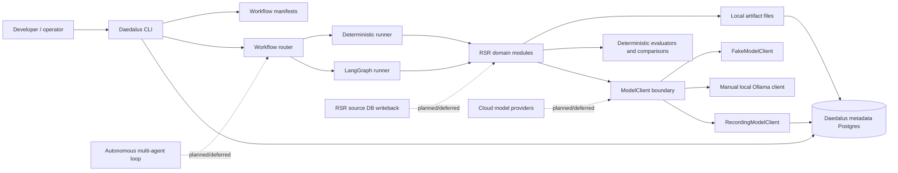
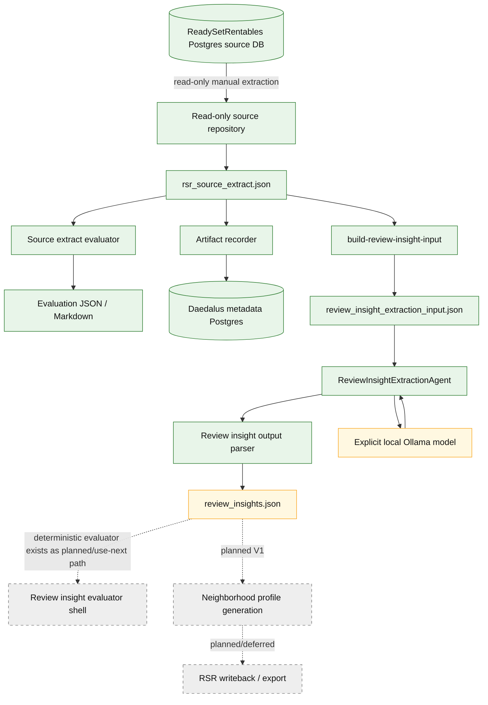
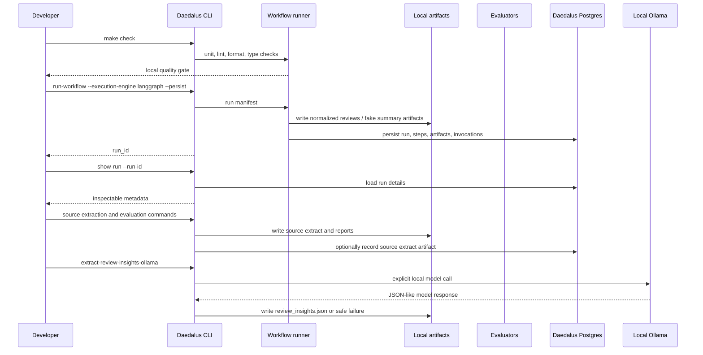
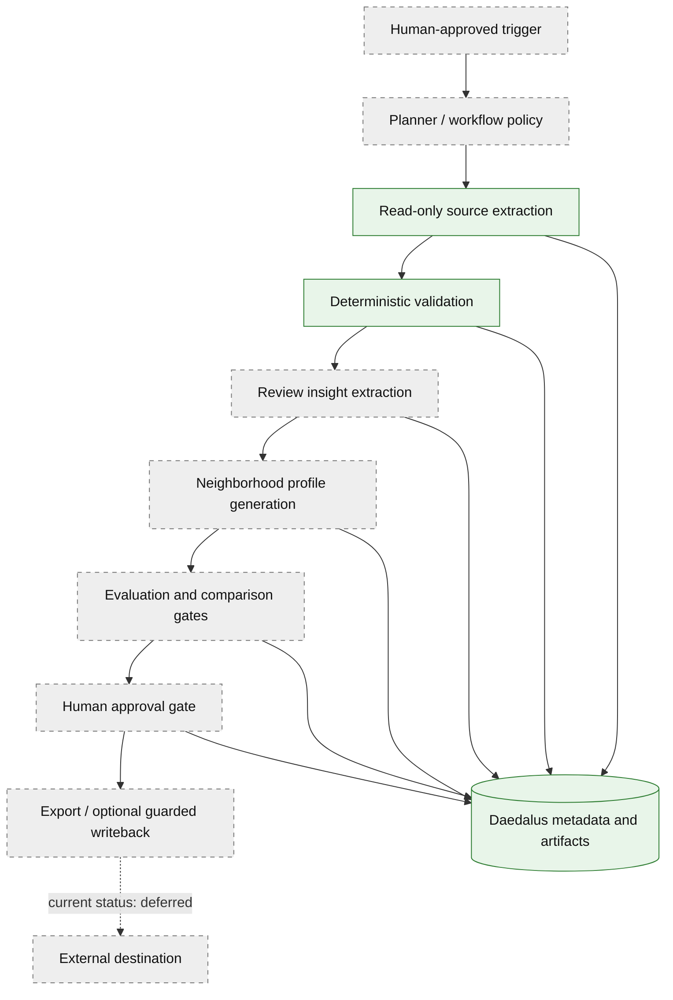

# Daedalus Architecture

Daedalus is a local-first Python AI workflow orchestration platform for
observable, human-approved AI pipelines. The current implementation supports
deterministic workflows, optional LangGraph execution, local artifact files,
metadata persistence in Daedalus Postgres, model invocation tracking, fake model
paths, explicit local Ollama paths, deterministic evaluations/comparisons, and a
read-only ReadySetRentables source extraction boundary.

This page is demo-oriented. It distinguishes what exists now from V1 work that
is intentionally deferred.

## Current Platform Architecture

Current behavior:

- `run-workflow` can execute deterministic workflows and LangGraph workflows.
- Workflow runs, steps, artifacts, and model invocation records can be persisted
  to Daedalus Postgres.
- Generated artifacts are local files under `artifacts/`.
- Fake model paths are testable and provider-free.
- Ollama is explicit, local, and manual. It is not the default provider and is
  not wired into `run-workflow` or LangGraph for review insights.
- Deterministic evaluators and comparisons run as explicit CLI paths.

Deferred behavior:

- Cloud model providers are not implemented.
- Source-derived review insight extraction is not wired into LangGraph.
- No autonomous multi-agent loop is active.
- Daedalus does not write back to the ReadySetRentables source database.

## RSR Source Extraction And Review Insight Pipeline

Current RSR behavior:

- Source extraction from the RSR Postgres database is read-only and manual.
- `rsr_source_extract.json` generation works.
- Source extract evaluation works through deterministic checks.
- Source extract artifacts can be recorded against Daedalus workflow runs.
- `review_insight_extraction_input.json` generation works.
- `ReviewInsightExtractionAgent`, parser, CLI, and artifact writer exist.

Needs UM790 validation:

- `extract-review-insights-ollama` with `qwen2.5-coder:7b` should be rerun
  after the safe diagnostic improvements. It should either write
  `review_insights.json` or fail with a safe diagnostic category.

## Demo-Ready Workflow Path

For the portfolio demo, keep the screen focused on commands, success metadata,
artifact filenames, and `show-run` output. Do not display raw review text,
artifact contents from real data, prompt text, raw model output, `.env` values,
DSNs, secrets, or private network details.

## Planned V1 Agentic Loop

V1 intent:

- Keep source extraction read-only until an explicit guarded export or writeback
  path is designed.
- Route every model call through the `ModelClient` boundary.
- Preserve artifact lineage, model invocation metadata, prompt identity, token
  counts, costs when available, and deterministic evaluation outputs.
- Add human approval before any external publication or writeback.

Not V1-ready yet:

- LangGraph wiring for source-derived review insight extraction.
- Claude/Anthropic or other cloud provider clients.
- Neighborhood profile generation from review insights.
- Autonomous repair/retry loops for model JSON failures.
- Any writeback to the ReadySetRentables source application.
